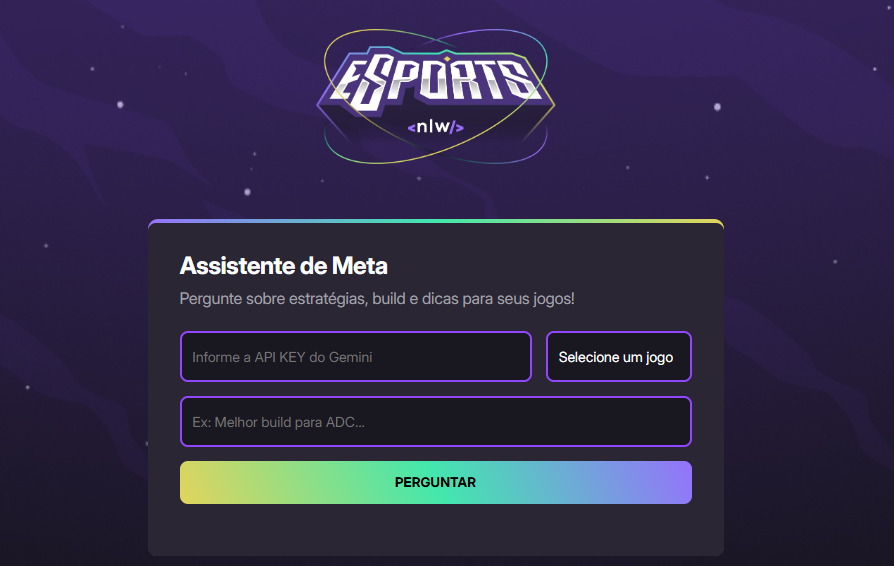

# 🚀 Projeto NLW - Rocketseat (Esports Builds LoL)

Este projeto foi desenvolvido durante o evento NLW da Rocketseat com o objetivo de criar uma interface simples que utiliza inteligência artificial (Google Gemini) para sugerir a melhor build para campeões de jogos como **League of Legends**, **Valorant** e **CS:GO**. 

---

## ✨ Funcionalidades

- Busca personalizada com IA (Gemini)
- Interface simples em HTML/CSS
- Interação dinâmica com JavaScript
- Sugestão de itens, feitiços e habilidades com base no nome do campeão

---

## 🛠️ Tecnologias utilizadas

- HTML5
- CSS3
- JavaScript (Vanilla)
- Google Gemini (IA generativa)
- VS Code

---

## 📷 Imagem do projeto

---

## 🧠 O que aprendi

> "Durante esse evento da Rocketseat, aprendi a integrar IA no front-end, além de reforçar minhas habilidades com HTML, CSS e JavaScript.  
Mesmo em transição de carreira, acredito que a vontade de aprender supera qualquer barreira.  
Sou grato à Rocketseat pelo conteúdo gratuito e de qualidade!"

---

## 🤝 Agradecimentos

Obrigado à [Rocketseat](https://www.rocketseat.com.br/) pelo evento gratuito e incrível!

---

## 📌 Autor

**Thiago de Brito Corteis**  
[🔗 LinkedIn](https://www.linkedin.com/in/thiiagobc)  
[🔗 GitHub](https://github.com/thiiagobc)
